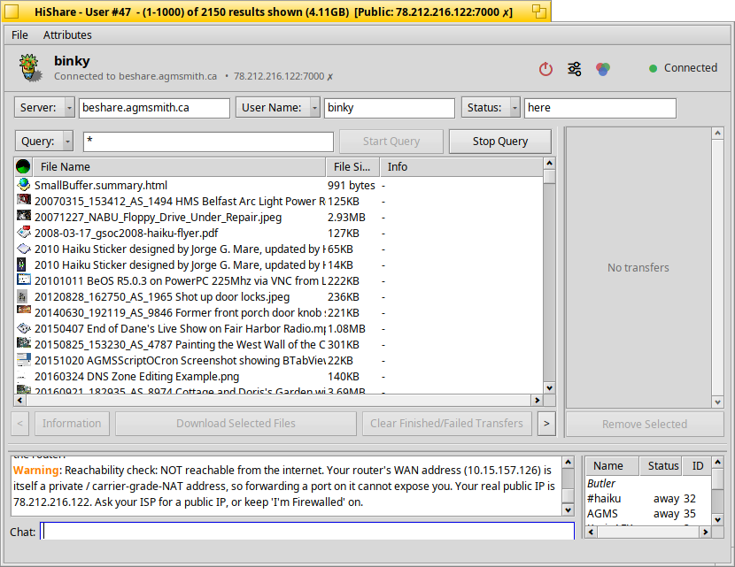

# HiShare

**HiShare 1.0** is a Haiku-native file-sharing and chat client — the modernized
edition of the classic [BeShare](https://public.msli.com/lcs/beshare/) 3.04. It
speaks the same MUSCLE protocol, so it interoperates with existing BeShare servers
and clients, while adding automatic router port-forwarding, a theme-aware modern
GUI, and a refreshed build on top of MUSCLE 6.11.

> It all started as an update to BeShare 3.04 and grew into its own edition.



## What it does

- Share and download **any** type of file over a MUSCLE server, with live queries
  (new matching files appear in your results as they are shared — no refresh).
- Browse files with their Haiku **attributes**, like a Tracker view.
- Built-in **chat**, private messages, and user watching.
- Any number of simultaneous uploads/downloads, serialized per-host for efficiency,
  with resume support.

## What's new in HiShare 1.0

- **Automatic router port-forwarding** — UPnP IGD, NAT-PMP and PCP are tried
  automatically so you are reachable from outside your home NAT without touching
  the "I'm Firewalled" switch. Includes an **external reachability probe** that
  detects CGNAT and tells you your real public address.
- **Modern, theme-aware GUI** — a status header banner (app icon, your name, live
  connection state) with quick-action buttons (Connect/Disconnect, Settings,
  Colours) built in; a categorised **Settings window** replacing the old 24-item
  menu; and colours derived from the Haiku system palette so light/dark themes are
  respected everywhere (lists, headers, tool-tips, transfers) and re-theme live.
- **Native localization** — the UI follows the Haiku system language via the Locale
  Kit (catkeys), across ~20 languages.
- **MUSCLE 6.11** under the hood (upgraded from 3.20), soak-tested for repeated
  multi-hundred-MB transfers.
- Drag-and-drop to share, desktop notifications, and a byte-range transfer
  foundation for future multi-source (swarming) downloads.

> **Note on TLS:** encrypted transfers are present in the codebase but **disabled
> for 1.0** (a crash on the SSL client path is still being fixed). See
> `CHANGELOG.md`.

## Building

```
cd source/hishare
make            # builds the "HiShare" binary
make catalogs   # (optional) regenerate the localization catalogs
make clean
```

MUSCLE is bundled under `source/muscle/` — no separate download needed. See
[`COMPILING.md`](COMPILING.md) for details and dependencies.

## Firewall note

If your router does not support UPnP/NAT-PMP/PCP and you are behind a NAT, enable
**"I'm behind a firewall"** in Settings → Network. People who are *not* firewalled
can then still download from you.

## Lineage & credits

HiShare is built on BeShare, originally by **Jeremy Friesner** and **Vitaliy
Mikitchenko**, with later updates by BBJimmy, Pete, AGMS and others. The MUSCLE
messaging library is by Jeremy Friesner / Meyer Sound. Haiku modernization
(HiShare) by **atomozero**.

The application icon is the classic BeShare "flower" from the community
[HVIF Store](https://www.hvif-store.art) (MIT-licensed), keeping the visual lineage.

BeShare and MUSCLE are used under their original licenses; see the upstream
projects for details.
